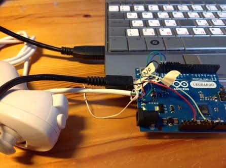
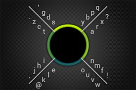
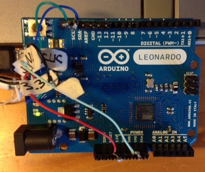

<<<<<<< HEAD
8Pen Emulator
8Pen Keyboard and Mouse Emulation

#Nunchuck and Arduino Leonardo





#Motivation

This is part of a more general project based on challenging the concept of keyboard + mouse

The basic idea is “I only have 2 hands. I need both hands for my keyboard. Why the hell was the mouse ever invented ?”

There are 2 solutions to the problem:

1- Do not use the mouse, dedicate both hands to the keyboard

2- Find a sngle hand keyboard, and uses you free hand for the mouse

I tried mulitples “single hand keyboard” approaches. (learn to use the full keyboard with a single hand, Frog layout, mirrored layout. I can use all of them, but speed is always low


The idea of using the same keyboard approach for mobile and desktop raised my curiosity, but I did not have high expectations in terms of performance


#8Pen Presentation

Available only on android. Will never be available on iOS devices

Usage : Copied from http://www.8pen.com/concept





    To enter a letter, start by placing the finger/pointer in the central region
    Without lifting, move out in the sector that contains the letter
    Turn clockwise or anti-clockwise, according to the side on which the letter lies
    Cross 1 to 4 branches, according to the order of the letter on the boundary, and return to the center to place it


#Implementation

Use the joystick on the nunchuck (not the accelerometers)

Use the buttons for special characters


#Limitations

Multi keys ExControl – C

Strict multi key is not possible

Could be done by Control followed by “C”, but very unconfortable

BUT it is possible to create a special “Control-C” key, or any frequently used key sequence


#Mouse Emulation

Was not part of the initial objective, but seemed a natural extension.

When C button is pressed, the joystick simply moves the mouse cursor.

Pressing C and Z buttons causes a left mouse click

No right mouse click at the moment


#Wiring

I had very limited equipment at hand at the time of execution. Cut the wires of the nunchuck, and solder on header rows, to be inserted into arduino

Use the HID USB emulation to connect to any computer. Nothing to do on the computer.





My nunchuck is white, and has 5 wires

Do not blindly trust the wiring instrucations below, your device may be different.

There are multple articles on the web helping for the connection of a nunchuck to an arduino


Colour Connect to Signal

Black Not Connected 

Blue Arduino SDA Data

Green Arduino SCL Clock

White / ligh Green Arduino GND GND

Red Arduino +3.3V 3.3 V


Connect the USB mini arduino connector to a USB plug on the computer. The computer provides 5V to the arduino, which in turns provides 3.3 V to the nunchuck. This has worked on a wide range of computers, running linux and windows. No current limitation problem noticed


#Code Structure


Using ino python framework

I2C for communication with nunchuck


##Setup function

Initialize Wire library for i2c connections

Keyboard.init

Mouse.init


##Loop Function

if cButton is pressed, uses the mouse mode

Simpy move the mouse in the appropriate direction


Read x an y coordinates (0 - 255)

Convert to center based coordinates (-128 - +127)


Convert to polar coordinates (Radius, angle)

Optimisation 

In fact, does not calculate the angle itself, but only the cosinus of the angle.

Similarly, does not calculate the radius, but radius * radius


Radius is used to determine if within the central area

Cosine of Angle Plus X polararity determines the segment


Logic is simple.

Remains in central area: Do nothing

Outside of central area: Keep record of quadrants visited

Back in central area: Process sequence, and send character


ParseSequence Function


Parses the sequence and send the corresponding key to USB

if zbutton is pressed, uses the keypad mode. Otherwise, uses the standard keyboard mode


##Extensions of the 8Pen standard

New line, space and back space on single movement ( simple down, right or left)


#Learning Required

Learning is not trivial, but reasonable. 1 to 2 weeks of 20 minutes daily practice should get you started.

I recommend purchasing 8Pen for android for 99 cents for learning

#Can it be useful ?

Whenever full control in one hand is required

Handicaped, professional activity, presentation

Keyboard can easily be curstomised for a given subset of keys of professional usage (data collection, control)


Comments :

rdubois440@gmail.com


#Future developments

#pdf conversion   
```
pandoc -s -o 8pen_Nunchuck_Leonardo.pdf  -V geometry:"top=1cm, bottom=1cm, left=1cm, right=1cm" README.md
```
#github
https://github.com/rdubois440/8Pen_Nunchuck_Leonardo

=======
# 8Pen_Nunchuck_Leonardo
A keyboard emulator using 8Pen approach on a Nunchuck connected to a Leonardo
>>>>>>> 82110227c8808ef40c6ebc9f6fd93ee4b9b1a2de
